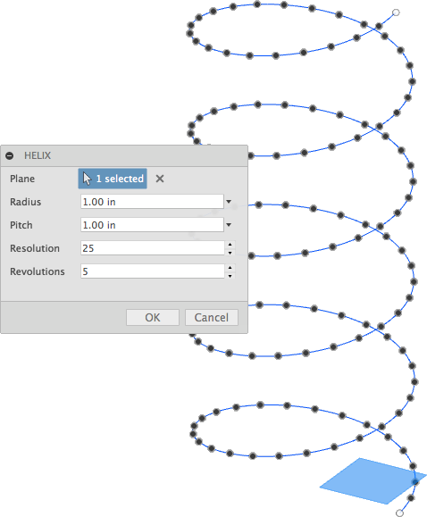

# HelixGenerator
Fusion 360 addin to generate helical curves

Note this curve is an approximation of a helix and not a true mathematical helix.

# Installation
[Click here to download the Add-in](https://github.com/tapnair/HelixGenerator/releases/download/1.0/HelixGenerator.zip)

After downloading the zip file follow the [installation instructions here](https://tapnair.github.io/installation.html) for your particular OS version of Fusion 360 

## Usage:
Select a plane or planar face and let it generate a helix from the origin of that plane or face

## License
Samples are licensed under the terms of the [MIT License](http://opensource.org/licenses/MIT). Please see the [LICENSE](LICENSE) file for full details.

## Written by

Written by [Patrick Rainsberry](https://twitter.com/prrainsberry)   (Autodesk Fusion 360 Business Development)

See more useful [Fusion 360 Utilities](https://tapnair.github.io/index.html)

